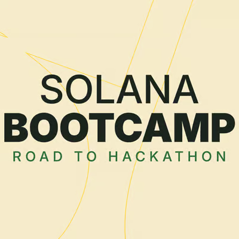

# ☀️ Solana Bootcamp: Do Zero à Devnet
**Pau dos Ferros, IRL** | *Roteiro Definitivo e Materiais de Apoio*

Este repositório contém o passo a passo absoluto para você saltar da abstração do "No-Code" com Inteligência Artificial para a engenharia de alta performance em baixo nível utilizando **Rust, Anchor e a infraestrutura da Solana**. O material foi construído para ser devorado.

O que você verá aqui não é teoria de tutorial. É tática de guerra de Hackathon. ⚔️

---

## 🗺️ Mapa de Batalha (O Passo a Passo)

Siga os documentos na ordem abaixo. Você e sua equipe podem utilizá-los como guia de consulta rápida durante os hackathons.

### 🛠️ Fase 1: Setup Local (Instalação em 4 Passos)
A base da engenharia precisa estar instalada no seu terminal (Linux, Mac ou WSL).
1. [Preparando Node.js e Yarn](docs/1-instalacao/01-nodejs-yarn.md)
2. [Instalando o Compilador Rust](docs/1-instalacao/02-rust.md)
3. [Instalando a Solana CLI (Chaves e Rede)](docs/1-instalacao/03-solana-cli.md)
4. [Instalando o Anchor Framework (via AVM)](docs/1-instalacao/04-anchor-cli.md)
5. [Pegando Faucet na Devnet p/ Deploy e Taxas](docs/1-instalacao/05-faucet-solana.md)

### 🧠 Fase 2: Fundamentos e Arquitetura 
Abra a caixa preta. Entenda *por que* seu app roda na velocidade da luz.
1. [De onde saímos? Recap do Vibecoding](docs/2-conteudo-explicacao/00-recap-vibecoding.md)
2. [A Estratégia do Espectro de Ferramentas AI (O Sweet Spot)](docs/2-conteudo-explicacao/13-espectro-ferramentas-ai.md)
3. [Revisão: 5 Core Concepts da Solana](docs/2-conteudo-explicacao/05-recap-conceitos.md)
4. [O Diferencial Arquitetônico: Stateless e Paralelização](docs/2-conteudo-explicacao/06-arquitetura-diferenciais.md)
5. [O Motor Nativo: Programs Básicos da Rede](docs/2-conteudo-explicacao/08-programs-nativos.md)
6. [Tabela de Custos: Rent e Alocação de Espaço](docs/2-conteudo-explicacao/07-rent-espaco.md)
7. [Transações e Instruções: Como a rede recebe ordens](docs/2-conteudo-explicacao/09-instructions-transactions.md)
8. [PDAs: O Banco de Dados Determinístico (Deep Dive)](docs/2-conteudo-explicacao/10-deepdive-pdas.md)
9. [A Anatomia Perfeita dos Tokens (SPL e Metadata)](docs/2-conteudo-explicacao/11-anatomia-tokens.md)
10. [Checklist: Segurança 101 On-Chain](docs/2-conteudo-explicacao/19-seguranca-101.md)
11. [Scalabilidade: De Vault a um Produto DeFi](docs/2-conteudo-explicacao/20-vault-a-produto.md)
12. [Cultura: Colosseum e Solana Hackathons](docs/2-conteudo-explicacao/21-colosseum-hackathons.md)

### 💻 Fase 3: Prática e Código (Hands-on)
É hora de construir o nosso primeiro Building Block para o Hackathon.
1. [Do Noah para a Realidade: Mapeando a Arquitetura do Neobank](docs/3-pratica-codigo/12-exercicio-mapa-neobank.md)
2. [Construindo o Vault na Unha (Scaffold, Lógica e Contas)](docs/3-pratica-codigo/14-construindo-neobank-vault.md)
3. [Compilando, Testando no TS e Deploy na Devnet](docs/3-pratica-codigo/15-testes-deploy.md)
4. [A Grande Validação: Simulando uma auditoria no Explorer](docs/3-pratica-codigo/16-verificacao-explorer.md)
5. [Bônus Especial: Integração com Frontend / WalletAdapter e Solana Vault Standard (SVS)](docs/3-pratica-codigo/17-bonus-frontend-svs.md)
6. [🔥 Desafio Prático Pró: Adicionando close_vault e devolvendo rent!](docs/3-pratica-codigo/19-desafio-close-vault.md)

### 🎯 Fase Final
* [Conclusão e Orientações Cruzadas para o Hackathon](docs/2-conteudo-explicacao/18-conclusao-duas-abordagens.md)

---

## 🤖 Ferramentas de Produção e Referências
Se quer atingir o estado de arte no Hackathon e focar 100% no produto, use o nosso cinto de utilidades:
* **Solana Claude Config:** Todos os agentes especializados que utilizamos em exemplos (`.claude`, `CLAUDE.md`, etc) vêm do repositório mantido pela fundação [github.com/solanabr/solana-claude](https://github.com/solanabr/solana-claude).
* **SolanaBR Wiki:** Todas as dúvidas técnicas massivas respondidas em um só lugar de comunidade aberta [github.com/solanabr/wiki](https://github.com/solanabr/wiki).

* **Colosseum Hackathon Version PT (ParaDevs) - March 2026.pdf**: [Link para o PDF](Colosseum%20Hackthon%20Version%20PT%20%28ParaDevs%29%20-%20March%202026.pdf)

* **Do Zero a devnet**: [Link para o material](https://gamma.app/docs/Do-Zero-a-Devnet-3zxlunx67x88k7a?mode=doc)

Bora "buidar"! 🚀
